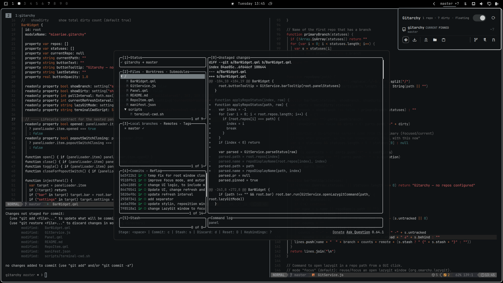

# Gitarchy

Git status for watched repos in the Omarchy bar: dirty counts, branches,
stash, ahead/behind, and one-click access to lazygit.



## What you see

- **Bar widget** — the primary branch and the total dirty count across all
  watched repos (`main +3`). Hidden when no repos are configured. Left-click
  opens the panel, right-click opens lazygit for the primary repo, middle-click
  refreshes immediately.
- **Panel** — one row per watched repo with the branch, staged/modified/
  untracked counts, stash count, and ahead/behind. Click a row to expand its
  actions; double-click opens lazygit directly.

Per-repo actions: open lazygit, `git fetch`, copy the remote URL, and a
click-to-reveal PR status line (via GitHub CLI, when `gh` is installed).

## Install

```sh
omarchy plugin add https://github.com/miseriae/gitarchy --enable
```

The widget joins the bar's right section at the next shell reload
(`omarchy restart shell`). Remove it with:

```sh
omarchy plugin remove miseriae.gitarchy
```

## Requirements

- Omarchy with a bar (Quattro / Quickshell)
- `git` in the runtime PATH
- Optional: `lazygit` for the "Open lazygit" actions
- Optional: `gh` (GitHub CLI) for the PR status line
- Optional: `wl-clipboard` (`wl-copy`) for the "Copy remote URL" action

## Configure

Watched repos live in the widget's entry in `~/.config/omarchy/shell.json`.
Set them with `omarchy bar set`:

```sh
omarchy bar set miseriae.gitarchy repos '["/home/you/projects/a", "~/projects/b"]' --json
omarchy bar set miseriae.gitarchy pollInterval 60
```

Or edit the layout entry directly:

```json
{
  "version": 1,
  "bar": {
    "layout": {
      "right": [
        { "id": "miseriae.gitarchy", "repos": ["~/projects/a"], "pollInterval": 30 }
      ]
    }
  }
}
```

### Settings

| Key | Type | Default | Description |
| --- | --- | --- | --- |
| `repos` | array | `[]` | Repo paths (strings) or `{ "path": ..., "name": ... }` objects. Paths may use `~`. |
| `pollInterval` | int | 30 | Seconds between git status refreshes. |
| `showBranch` | bool | `true` | Show the primary branch in the bar. |
| `showDirty` | bool | `true` | Show the total dirty count in the bar. |
| `lazyGitMode` | enum | `focus` | `focus`: reuse/focus an open lazygit window. `floating`: always open a new floating terminal. |

A repo entry's `name` overrides the display label; it defaults to the folder
name.

## Usage

- **Click** the bar widget to open the status panel
- **Hover** the bar widget for a per-repo tooltip
- **Click** a repo row to expand its actions
- **Double-click** a repo row to open lazygit
- **Right-click** the bar widget to open lazygit for the primary repo
- **Middle-click** the bar widget to refresh now

The header toggle switches how lazygit is opened — **Focus** (reuse/focus an
open lazygit window) or **Floating** (always open a new floating terminal).
The choice persists and is the same `lazyGitMode` setting shown in the table
above.

## How it works

Each watched repo is polled on the configured interval. A small bash script
runs `git status --porcelain=v1`, `git stash list`, and an upstream
ahead/behind count, emitting a single JSON line the widget parses. Bar text is
derived from those counts; nothing leaves the machine and no network calls are
made (PR status is fetched on demand only, via `gh`, when you reveal it).

## License

MIT — see [LICENSE](LICENSE).
